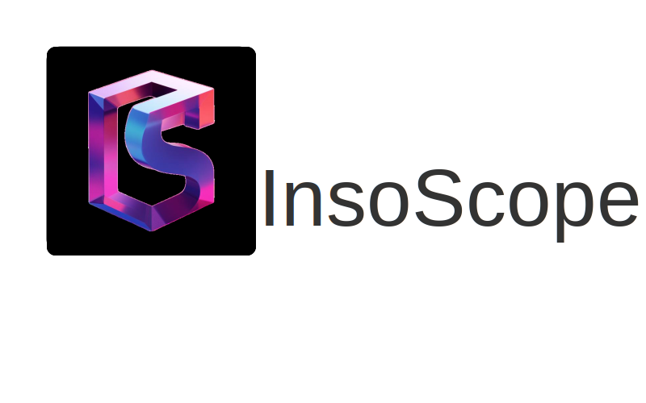

<h1 align="center">InsoScope</h1>

Block explorer for the deterministic Flatgas blockchain.

InsoScope provides a user-friendly interface to view, confirm, and inspect transactions on the Flatgas blockchain — a Layer 1 protocol built on predictability, fairness, and protocol-level fee stability.

It is a customized fork of [Blockscout](https://github.com/blockscout/blockscout), adapted to reflect the design goals and branding of the Flatgas ecosystem and its native token, `inso`.

## About InsoScope

InsoScope allows users to search for transactions, view accounts and balances, verify smart contracts, and inspect the Flatgas chain transparently.

It builds on Blockscout’s open-source core, tailored to support the Flatgas chain’s deterministic, non-bidding fee model.

## Getting Started

See the [project documentation](https://docs.blockscout.com/) for general instructions (valid for InsoScope too):

- [Manual deployment](https://docs.blockscout.com/for-developers/deployment/manual-deployment-guide)
- [Docker-compose deployment](https://docs.blockscout.com/for-developers/deployment/docker-compose-deployment)
- [ENV variables](https://docs.blockscout.com/setup/env-variables)
- [Configuration options](https://docs.blockscout.com/for-developers/configuration-options)

🧪 Development Environment (Planned Nix Support)

We plan to support Nix/NixOS-based development and deployment for InsoScope, to ensure reproducibility and environment consistency across contributors and nodes.

This is a work-in-progress as the team gradually integrates Nix support into our toolchain. Contributions welcome as we learn and build this support.

## Customization Highlights

- InsoScope branding (logo, name, color scheme)
- Flatgas chain configuration in progress
- Will evolve with native Flatgas protocol features

## Credits

This project is based on [Blockscout](https://github.com/blockscout/blockscout) and retains its GPLv3 licensing.

## Contributing

See [CONTRIBUTING.md](CONTRIBUTING.md) for contribution and pull request protocol. We expect contributors to follow our [code of conduct](CODE_OF_CONDUCT.md) when submitting code or comments.

## License

This project is licensed under the GNU General Public License v3.0. See the [LICENSE](LICENSE) file for details.
